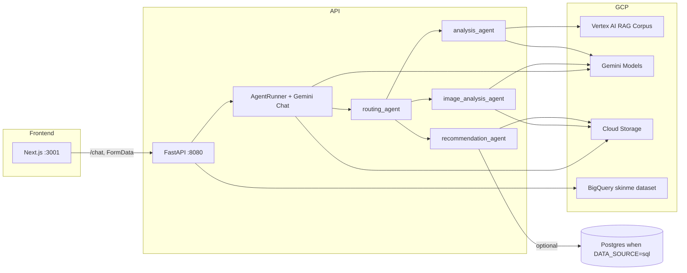

# SkinMe / AC215-HERM — System Architecture README

> **关于历史对话记录**  
> 本仓库环境中未能访问 Cursor 的 `agent-transcripts` 目录，因此本文档**直接依据当前代码与现有说明文件**整理，而不是从某次对话 transcript 摘录。若你本机有 transcript，可将其中与本文冲突的部分以代码为准。

> **项目定位**  
> 面向**护肤品推荐**与**皮肤相关咨询**的 AI 应用：结合 **Vertex AI（Gemini + RAG）**、**结构化产品/成分数据（BigQuery / GCS）** 与 **个性化上下文（GCS 上的画像、聊天记录、日历、进度照）**，从聊天与可选图片输入一路打通到成分分析与商品匹配。

---

## 1. 全景：从浏览器到模型

- **本地开发**：根目录 `docker-compose.yml` 启动 `skincare-api`（8080）与 `frontend`（3001），前端通过 `NEXT_PUBLIC_API_URL` 指向 API。  
- **生产/课程部署**：见根目录 `README.md`（Milestone 5）：Pulumi 构建镜像、单 VM 或 **GKE + Nginx Ingress**（路径分流前端与 API）。  
- **设计文档中的 Chroma 管线**：`reports/Document.3 RAG Pipeline Design and Usage.md` 描述过多容器 + Chroma 的设想；**当前主路径为 Vertex RAG Corpus**（`RAG_CORPUS` 环境变量），以 `analysis_agent` 为准。

---

## 2. “有多少个 Agent？”——按职责划分

这里按**代码模块**说明（不必每个都对应一个独立 LLM）：

| 层级 | 模块 | 作用 |
|------|------|------|
| **路由** | `routing_agent.py` | `classify_intent_fast`：基于关键词的快速意图（`analysis_only` / `recommendation` / `both` / `image_history` / `none`），**不额外调用路由 LLM**。`route_and_process` 串联下游。 |
| **分析** | `analysis_agent.py` | 文本或图片推断皮肤关注点 → **Vertex `rag.retrieval_query`** 拉取知识 → Gemini 生成 **PRIMARY / SECONDARY / AVOID** 成分列表并解析为结构化字典。 |
| **推荐** | `recommendation_agent.py` | 根据分析结果在 **GCS 上 EWG 结构化 JSONL**（或 `DATA_SOURCE=sql` 时 Postgres）里**打分匹配**产品，含无匹配时的 **fallback**（洁面/保湿/防晒等基础类）。 |
| **历史图像** | `image_analysis_agent.py` | 从 GCS 按用户拉取多张照片，组 multimodal prompt，**Gemini 做跨日对比**（改善/恶化/稳定）。 |
| **对话与编排** | `api-service/runner.py` 中 `AgentRunner` | 维护 **Gemini Chat 会话**（`client.chats.create`），把用户消息、**个性化上下文**、以及上游 agent 的**结构化结果**转成二次 prompt，由**同一对话模型**输出最终自然语言（Markdown、安全与上下文使用规则在 system instruction 里）。 |
| **支撑（非独立“聊天 Agent”）** | `bigquery_service.py`、`ingredient_analyzer.py`、`ingredient_risk_classifier.py`、`daily_routine_manager.py` 等 | REST 查询产品成分、routine 成分汇总、趋势洞察等。 |
| **个性化** | `personalization/*` | 画像、聊天记录、日历、天气格式化、图片上传、缓存等，为 `UserContextRetriever.get_smart_context` 提供 **=== SYSTEM CONTEXT ===** 块。 |

**小结**：严格说有多条 **“工具型 agent 流水线”**（分析、推荐、图像历史）+ **一个主导航用的对话 Gemini**；路由层是**规则引擎**，不是第三个 LLM。

---

## 3. RAG：如何实现、检索什么

- **实现位置**：`src/api-service/agent/analysis_agent.py`。  
- **依赖**：`vertexai.preview.rag` 的 `retrieval_query`，`rag_corpus` 来自环境变量 **`RAG_CORPUS`**（`docker-compose.yml` 中为 `projects/.../locations/.../ragCorpora/...`）。  
- **流程**：  
  1. 若有 **base64 图片**：Gemini 多模态先产出文字描述作为 `condition`。  
  2. 若仅有文本（可带 `User query:` 前缀以剥离前文上下文）：从用户句子里得到 `condition`。  
  3. 用自然语言问句检索：`What are the most effective ingredients for treating {condition}?`，`similarity_top_k=10`。  
  4. 将检索片段拼进 prompt，要求模型按 **PRIMARY / SECONDARY / AVOID** 固定格式输出，再由 `parse_response` 结构化。  
- **与“向量库”文档的关系**：仓库内 `Document.3` 的 Chroma 流程是并行设计叙事；**运行时代码以 Vertex RAG Corpus 为准**。

---

## 4. 推理（Inference）与模型

- **对话与会话**：`AgentRunner._get_chat` 使用 `GEMINI_MODEL`（compose 中示例为 `gemini-2.0-flash`），`temperature=0.3`，长 system instruction 约束上下文使用与安全（防晒、过敏等）。  
- **分析与 RAG 后结构化**：`analysis_agent` 内写死使用 `gemini-2.5-flash`（与对话模型可不同，以各文件为准）。  
- **推荐**：`recommendation_agent` 的匹配主要是 **确定性字符串/打分**，不必须每次调用 LLM；最终话术仍由对话模型生成。  
- **图像历史**：`image_analysis_agent` 默认 `GEMINI_MODEL` 环境变量或 `gemini-2.5-flash`。  
- **统一入口**：Vertex 通过 `GOOGLE_GENAI_USE_VERTEXAI`、`GCP_PROJECT`、`GOOGLE_CLOUD_LOCATION` 与 service account JSON（`GOOGLE_APPLICATION_CREDENTIALS`）初始化。

---

## 5. 数据如何存放与管理

| 数据 | 位置 | 说明 |
|------|------|------|
| 用户凭证与注册信息 | GCS（`auth_manager`） | 登录注册、邮箱检查等。 |
| 聊天日志与画像抽取 | GCS（`chat_logger`、`profile_extractor`） | 用于个性化与后续上下文。 |
| 皮肤进度照 | GCS `user_image/{identifier}/` | 上传、列表、代理下载、`notes.json` 备注。 |
| 日历事件 | GCS（`calendar_manager`） | 支持 email 或 `session_id`。 |
| 每日 routine | GCS `daily_routines/{safe_user}/{date}.json` | CRUD + 与 BigQuery 成分联动做汇总。 |
| 推荐用产品目录 | GCS `EWG_face_product/ewg_product_structured.jsonl` 或 **Postgres `ewg_product`** | 由 `DATA_SOURCE` 切换。 |
| 产品/成分查询 API | **BigQuery** `GCP_PROJECT_ID.BIGQUERY_DATASET`（默认 `skinme`） | `products`、`ingredients`、`product_ingredients` 等表；搜索与按 ID/URL 查成分。 |
| RAG 知识库 | **Vertex RAG Corpus** | 不在应用容器内自建向量服务（与旧 Chroma 设计区分）。 |

可选：**DVC + GCS** 做数据集版本（见 `README-milestone4.md`）。

---

## 6. Full stack：前端 → 后端

- **前端**（`src/frontend`）：Next.js；开发 Dockerfile `Dockerfile.dev`；调用 `NEXT_PUBLIC_API_URL`（本地常为 `http://localhost:8080`）。  
- **核心聊天**：`POST /chat`（`main.py`）— `Form`：`message`、`session_id`、`email`、`image` 文件、`weather` JSON 字符串 → `runner.run`。  
- **其它能力**（节选）：  
  - `GET/POST` 日历、`/skin-photos/*`、聊天历史、`/weather/*`  
  - `/api/products/search`、`/api/products/{id}/ingredients`、`/api/routines/*`、`/api/ingredient-insights/*`  
- **鉴权**：`/auth/register`、`/auth/login`、`/auth/check-email/{email}`。  
- **CORS**：当前 `allow_origins=["*"]`，生产应收紧。

---

## 7. 一次 `/chat` 请求的推荐路径（逻辑顺序）

1. 可选：图片转 base64；解析 `weather`。  
2. 若带 `email`：可把图片写入 GCS。  
3. `user_context_retriever.get_smart_context`：拼接画像、近期聊天、天气、日历等 → 与 `User query:` 拼在用户消息前。  
4. `classify_intent_fast`：决定是否走 agent。  
5. 若需要：`route_and_process` → `analyze_skin`（RAG）→ 必要时 `recommend_products` 或 `analyze_user_image_history`。  
6. 将 agent 输出经 `_format_agent_data_for_chat` 交给 **Gemini Chat** 生成最终回复。  
7. 若已登录：`chat_logger` + `profile_extractor` 写回 GCS。

---

## 8. 部署与环境变量（速查）

- **Compose**：见 `docker-compose.yml` — `GCP_PROJECT`、`GOOGLE_CLOUD_LOCATION`、`BUCKET_NAME`、`RAG_CORPUS`、`BIGQUERY_DATASET`、`DATA_SOURCE`、`DB_*`（sql 模式）、端口映射。  
- **K8s / VM**：`src/deployment/` 下 Pulumi 栈；根 `README.md` 含 sslip.io、Ingress 路径、`/api-service` 与前端分流等说明。  
- **敏感信息**：勿将真实密码提交仓库；compose 中的 `DB_PASSWORD` 等仅作本地示例，生产用 Secret。

---

## 9. 与现有文档的关系

- **`README-milestone4.md`**：端到端 RAG 工作流、个性化、测试与 DVC 等，可与本文对照阅读。  
- **`README.md`**：以 **部署与 Pulumi/K8s** 为主。  
- **`reports/Document.3*.md`**：早期多容器 + Chroma 的 RAG 管线设计；理解历史方案时有用，**实现以 Vertex + 本 README 第 3 节为准**。

---

## 10. 维护建议

- 新增能力时明确：**走对话-only**、**走 RAG**、还是 **走 BigQuery/GCS 结构化 API**，避免重复造检索层。  
- 路由关键词在 `routing_agent.py` 集中维护，改动后应用典型问句回归测试聊天与推荐路径。  
- `GEMINI_MODEL` 与各 agent 内写死的模型名若不一致，建议在文档或统一配置中说明原因（成本、延迟、多模态能力等）。

---

*文档生成：基于仓库当前源码与 `README-milestone4.md`、`README.md`、`reports/Document.3 RAG Pipeline Design and Usage.md`。*
