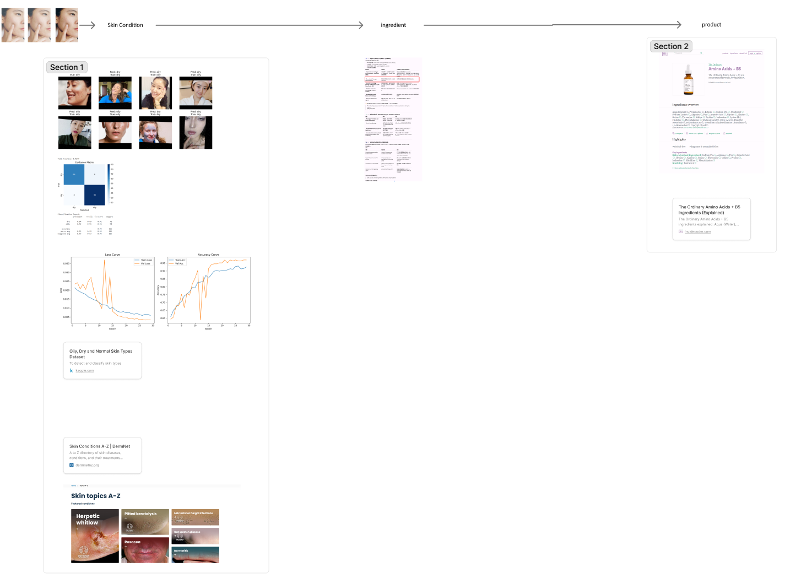
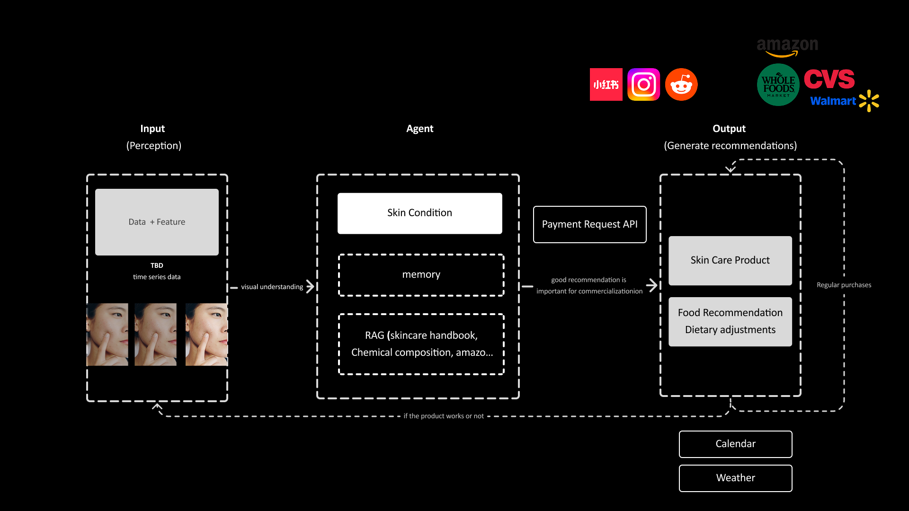
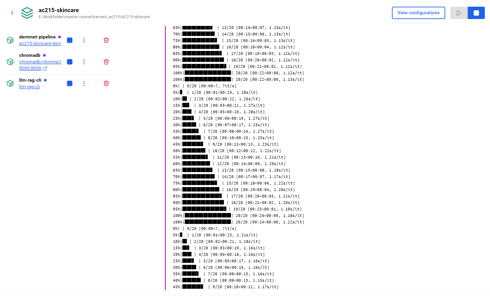
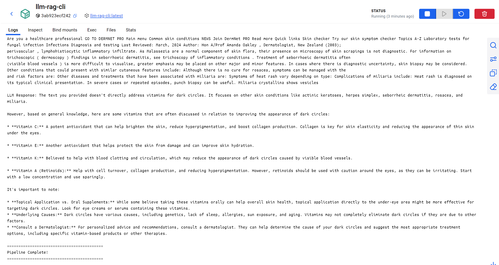
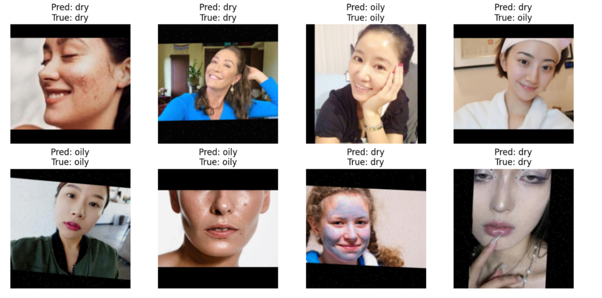
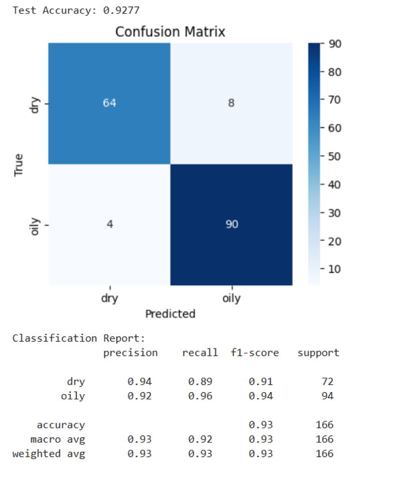
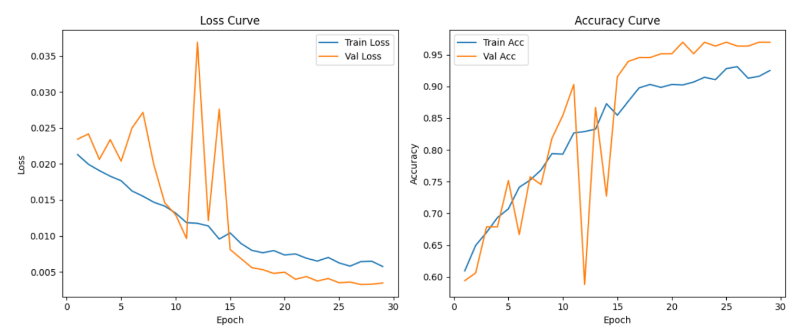

# AC215 - Milestone 4 - AI-Powered Skincare Application
Most files are modified as we restructured the code. We decoupled the data-preprocessing segment (in MS2) from the current pipeline.

**Team Members**
Ruyi Yang, Minh Tran, Hang Zhao, Jingrui Liu

**Group Name**
HERM

## Project Overview

This project builds an AI-powered skincare recommendation system that integrates **FastAPI, Gemini LLM, and Vertex AI RAG** to deliver personalized ingredient and product suggestions. It uses a routing agent to classify user intent, retrieves dermatology knowledge via retrieval-augmented generation, and ranks products from a structured GCS dataset based on ingredient matching.

**New: Personalization System** - The system now includes user profile management, conversation history tracking, and image upload/analysis capabilities stored in GCS, enabling context-aware, personalized skincare recommendations.

The system is fully containerized with Docker Compose, allowing seamless deployment and API access from any GCP VM.


## 🚀 Setup Instructions

### Prerequisites
- Docker and Docker Compose installed
- Service account credentials (JSON file) with access to:
  - Vertex AI Platform
  - Google Cloud Storage

### Quick Start

1. **Clone the repository:**

2. **Add service account credentials:**
Download GCP credentials from: [llm-service-account.json](https://drive.google.com/file/d/1zeXcRk7OYI72gal_IoIyJouJeG466ttJ/view?usp=drive_link)
Place your service account JSON file under:
secrets/llm-service-account.json


3. **Run the application:**
```bash
docker-compose up --build
```

This will start both the API service (port 8080) and frontend (port 3001).

4. **Access the services:**
- **API**: http://localhost:8080/docs
- **Frontend**: http://localhost:3001

5. **Live Deployment:**
- **API**: https://skincare-api-309934976439.europe-west1.run.app/
- **API Docs**: https://skincare-api-309934976439.europe-west1.run.app/docs

6. **CI/CD & Testing:**
- Automated testing via GitHub Actions (96+ tests, 53% coverage)
- Run tests locally: `cd src/api-service && docker-compose run --rm skincare-api pytest -v`
- See [CI/CD Guide](documentation/CICD_README.md) for details

7. **Data Versioning:**
- Uses DVC (Data Version Control) with GCS for dataset versioning
- Reproduce datasets: `git checkout dataset_v1 && dvc pull` (or `dataset_v2`)
- Data stored in: `gs://ac215-skincare/dvc_store/`
- See [Data Versioning Guide](documentation/DATA_VERSIONING_README.md) for details

<!-- 8. **Frontend Design:**
- [Main Interface](https://www.figma.com/make/QXckkgwHgrqKqDxDh7ZmzU/LLM-Skin-Analysis-App?node-id=0-4&t=WsUlhmhSNQd9o6Qj-1)
- [Demo Prototype](https://www.figma.com/make/KYldvlIZrDqpKvYdM9mUeX/LLM-Skin-Analysis-App--Copy-?node-id=0-1&t=1j8FDTarmX19N7NX-1) -->

---


## End-to-End Workflow of the AI Skincare RAG System
### **1. User Interaction Layer (FastAPI Entry Point)**

- User sends a request to `/chat` via HTTP POST with optional email for personalization.
- The request body contains natural language text (and optionally an image).
- FastAPI receives and validates the input using the `ChatRequest` model.
- **Personalization Layer**: If email provided, system loads user profile, conversation history, and previous image analysis from GCS.
- FastAPI forwards the contextualized input to the Routing Agent for intelligent processing.

---
### **2. Routing Agent – Intent Classification**

- The Routing Agent uses Gemini LLM to determine what the user is asking for.


---

### **3. Analysis Agent – RAG Retrieval for Ingredient Insights**
- If analysis is required, the system interprets the skin condition:
  - If user provided an image → Gemini performs visual analysis.
  - If user provided text → Gemini infers the condition directly.
- The agent performs a Retrieval-Augmented Generation (RAG) query using Vertex AI:
  - Queries a dermatology knowledge base (RAG corpus).
  - Returns scientific insights on effective skincare ingredients.

**The result is structured into:**
- **PRIMARY ingredients** → must-have, clinically effective.
- **SECONDARY ingredients** → supportive benefits.
- **AVOID ingredients** → irritants or harmful for the skin condition.

---

### **4. Recommendation Agent – Product Matching and Routine Generation**
- Loads product data from Google Cloud Storage (JSON lines format).
- Filters and scores products based on ingredient relevance:
  - ✅ Matches PRIMARY ingredients (highest priority).
  - ✅ Includes SECONDARY ingredients.
  - ❌ Excludes AVOID ingredients.
- The top-scoring products are passed to Gemini to generate a personalized skincare routine.

**Gemini generates the final output:**
- Morning and night routine steps.
- Product usage instructions.
- Scientific justification for each step.
- Buy links if available.

---

### **5. Personalization & History Logging**
- **User Profile Manager**: Stores and updates user preferences (skin type, concerns, allergies).
- **Chat Logger**: Records all conversations to GCS in JSONL format (`user_chat_history/{username}/{YYYYMM}/`).
- **Image Upload Handler**: Saves uploaded images to GCS (`user_image/{username}/`) with timestamps.
- **Profile Extractor**: Automatically extracts skin information from conversations to update user profile.
- All data persists in GCS bucket `ac215-skincare` for cross-session continuity.

---

### **6. Final Response Returned via API**
The system returns a JSON object via the `/chat` endpoint:

**Request:**
```json
{
  "message": "I have wrinkles, recommend products",
  "session_id": "optional-session-id",
  "user_image": "optional-base64-image",
  "email": "optional-user-email"
}
```

**Response:**
```json
{
  "response": "Based on your needs, I recommend a routine focusing on...",
  "session_id": "generated-or-provided-session-id"
}
```

The response message contains the complete analysis including:
- Skin condition detection
- Primary and secondary ingredients
- Products to avoid
- Recommended products with purchase links
- Detailed skincare routine explanation


### **7. Deployment and Orchestration**
- The entire pipeline runs inside a Docker container.
- Vertex AI authentication is handled via a GCP Service Account JSON file mounted inside the container.
- **Cloud Run Deployment**: Deployed at `https://skincare-api-309934976439.europe-west1.run.app/`
- **Docker Hub**: `ruyiyangemma/skincare-api:latest`
- Additional agents can be added modularly without changing the entire system.


User Input (+ optional email) → FastAPI → Load User Context (profile + history + images) →
Routing Agent (Gemini) →
    If analysis → Analysis Agent (RAG Retrieval) → output ingredients
    If recommendation → Recommendation Agent → product scoring and ranking
    If both → analysis + recommendation sequentially
→ Gemini generates personalized skincare routine → Save conversation & extract profile info →
FastAPI returns JSON response


## What Are These Systems and What Do they DO?

### 🔀 Routing System
This system uses an LLM-powered decision layer to intelligently direct user requests:
- Analyzes the user’s natural language input using Gemini to determine intent.
- Classifies requests into “analysis”, “recommendation”, or “both”.
- Automatically orchestrates agent workflows based on intent, enabling dynamic multi-agent collaboration.
- Decouples user interface from backend logic, allowing new capabilities to be added without changing API endpoints.

---

### 🔬 RAG-Powered Analysis & Recommendation System
This integrated subsystem uses Retrieval-Augmented Generation (RAG) and agent-based reasoning to provide scientific, personalized skincare recommendations:

- Connects to a Vertex AI RAG Corpus containing clinically verified skincare and ingredient knowledge.
- Performs semantic retrieval to extract evidence-based ingredient insights relevant to the user's skin condition.

---

### 👤 Personalization System
This system maintains user context across sessions to provide truly personalized recommendations:

- **Profile Management**: Stores user skin type, concerns, allergies, and preferences in GCS (`user_profiles/`).
- **Conversation History**: Logs all interactions in JSONL format for context-aware responses (`user_chat_history/`).
- **Image History**: Saves and analyzes uploaded skin images over time to track progress (`user_image/`).
- **Auto Profile Extraction**: Automatically updates user profiles from natural conversations using LLM.
- **Context Retrieval**: Prepends relevant user context to queries for personalized RAG retrieval and recommendations.
- **Cross-Session Continuity**: All data persists in GCS bucket `ac215-skincare` for seamless multi-session experiences.

---


## Repository Structure
```
./AC215-skincare
├── README.md                   # This file
├── LICENSE
├── docker-compose.yml          # Container orchestration
├── documentation/              # Additional documentation
│   ├── API_README.md           # API endpoint details
│   ├── CICD_README.md          # CI/CD pipeline docs
│   ├── DATA_VERSIONING_README.md # Data versioning guide
│   ├── FASTAPI_README.md       # FastAPI service docs
│   └── FRONTEND_README.md      # Frontend documentation
├── src/
│   └── api-service/
│       ├── Dockerfile           # Container configuration
│       ├── pyproject.toml       # Python dependencies
│       ├── uv.lock              # Dependency lock file
│       ├── agent/               # Agent modules
│       │   ├── routing_agent.py           # Intent routing
│       │   ├── analysis_agent.py          # Skin analysis
│       │   ├── image_analysis_agent.py    # Image history analysis
│       │   ├── recommendation_agent.py    # Product recommendations
│       │   └── personalization/           # Personalization system
│       │       ├── user_profile_manager.py    # User profile storage
│       │       ├── chat_logger.py             # Conversation logging
│       │       ├── image_upload_handler.py    # Image upload to GCS
│       │       ├── user_context_retriever.py  # Context retrieval
│       │       └── profile_extractor.py       # Auto profile extraction
│       └── api-service/         # FastAPI service
│           ├── main.py          # API endpoints
│           └── runner.py        # Session & personalization management
│   ├── data-collection/         # Data scraping and preprocessing
│   │   ├── dermnet/             # DermNet scraping pipeline
│   │   └── ewg/                 # EWG product scraping
│   └── frontend/                # Next.js frontend application
│       ├── src/
│       │   ├── app/             # Next.js App Router
│       │   ├── components/      # React components
│       │   └── contexts/        # React contexts
│       └── package.json
├── tests/                       # Comprehensive test suite
└── data/                        # DVC-tracked datasets
```

## Data Sources

- **DermNet.org**: Comprehensive dermatological database with 20+ skin condition articles
- **Cosmetic Ingredients Review**: Specialized Cosmetic Ingredients data founded by the USindustry trade association for safety evaluation
- **Cosmetic Dermatology Literature**: Academic sources on cosmetic ingredients and treatments
- **EU Cosmetic Ingredient Database**: Regulatory information on cosmetic ingredients
- **Skin Problem Datasets**: Curated datasets for model training and validation
- **EWG’s Skin Deep® Database**: A science-backed database of over 135K skincare and cosmetic products. Provides ingredient transparency, toxicity scores, and verified product safety ratings.
-
## Technology Stack

### **Infrastructure & Deployment**
- **Docker + Docker Compose**: Containerizes the application and orchestrates multiple services.
- **Google Cloud Platform (GCP)**: Provides RAG infrastructure, storage, and AI services.
- **Cloud Run**: Serverless deployment platform for scalable API hosting.
- **Service Account Authentication**: Enables secure, credential-based access to cloud resources.
- **CI/CD**: GitHub Actions pipeline with automated testing (96+ tests, 53% coverage).

### **AI & Language Models**
- **LLM Engine**: Google Gemini 2.0 Flash / 2.5 Pro for natural language understanding and response generation.
- **Routing Intelligence**: LLM-based intent classification to dynamically orchestrate workflows.
- **Retrieval-Augmented Generation (RAG)**: Vertex AI RAG API for retrieving verified dermatological knowledge.

### **Knowledge & Data Layer**
- **Vertex AI RAG Corpus**: Stores structured medical and skincare knowledge for semantic retrieval.
- **Google Cloud Storage (GCS)**:
  - Product datasets in JSONL format
  - User profiles: `user_profiles/{username}/profile.json`
  - Conversation history: `user_chat_history/{username}/{YYYYMM}/`
  - Uploaded images: `user_image/{username}/`
- **Data Versioning**: DVC (Data Version Control) with GCS for dataset versioning (`dataset_v1`, `dataset_v2`)
- **Semantic Retrieval Engine**: Uses Vertex AI's vector-based similarity search to ground responses in facts.

### **Agent-Based Processing**
- **Routing Agent**: Uses the LLM to determine the correct agent workflow (analysis, recommendation, or both).
- **Analysis Agent**: Extracts skin conditions and ingredient recommendations using RAG.
- **Recommendation Agent**: Scores skincare products based on primary/secondary/avoid ingredient matching.
- **Image Analysis Agent**: Analyzes user's historical uploaded images from GCS.
- **Personalization Agents**:
  - User Profile Manager: Stores user preferences (skin type, concerns, allergies)
  - Chat Logger: Records conversation history in JSONL format
  - Image Upload Handler: Saves user images to GCS with timestamps
  - Profile Extractor: Auto-extracts skin info from conversations
  - User Context Retriever: Retrieves full user context for personalized responses

### **Backend Framework**
- **FastAPI**: Handles request routing, session handling, and API responses.
- **Uvicorn**: ASGI server for running FastAPI applications.
- **Pydantic**: Provides structured request validation and response modeling.

### **Frontend**
- **Next.js 15**: React-based web application with TypeScript
- **Mobile Support**: Capacitor for iOS/Android deployment
- **Features**: AI chat, image analysis, bilingual support (EN/ZH)

### **Testing & Quality**
- **CI/CD Pipeline**: GitHub Actions with automated testing
- **Test Coverage**: 53% (96+ tests: unit, integration, system, E2E)
- **Code Quality**: Ruff for linting and formatting

### **Future Expansion Capabilities**
- **Image-Based Skin Analysis**: Powered by Gemini Vision for computer vision input.
- **Cloud-Ready Architecture**: Designed for deployment to Cloud Run or Kubernetes for scalability.

---


## What We Did? (till Milestone 3)
### Pipeline and Corresponding Dataset




### Screenshot of Specialized RAG running successfully with multiple dockers




### TBA: Skin Problem Model Training: computer vision classification model training and validation
(Because the foundation model can already identify the skin condition well, this part is considered to be deleted
The training process is in image\image-analyzer.ipynb)

 




<!-- ## Features

### 🤖 Intelligent Dermatological Assistant
- Answer complex skin-related questions using RAG technology
- Provide evidence-based responses from dermatological literature
- Handle ingredient analysis and product recommendations

### 🔍 Visual Skin Analysis
- Classify skin conditions from images
- Analyze skin texture and problems
- Provide diagnostic insights (for educational purposes)

### 📚 Comprehensive Knowledge Base
- Continuously updated dermatological content
- Ingredient safety and efficacy information
- Treatment protocols and best practices

### 🔄 End-to-End Automation
- Automated data collection and processing
- Scalable containerized deployment
- Persistent vector database for fast retrieval -->


## License

MIT License

## Data Versioning

We use **DVC (Data Version Control) with Google Cloud Storage** for versioning large datasets and user-generated data:

- **dataset_v1**: Product catalog (`ewg_full_dataset_use_this.jsonl`)
- **dataset_v2**: Product catalog + user data (chat history, images, profiles)

**Reproduce datasets:**
```bash
git checkout dataset_v1  # or dataset_v2
dvc pull
```

Data stored in: `gs://ac215-skincare/dvc_store/`

## Testing

Run tests locally:
```bash
cd src/api-service
docker-compose run --rm skincare-api pytest -v
```

**CI/CD**: Automated testing via GitHub Actions (96+ tests, 53% coverage)

## Additional Documentation

- [API Documentation](documentation/API_README.md) - Cloud Run deployment
- [CI/CD Guide](documentation/CICD_README.md) - Testing pipeline
- [Data Versioning](documentation/DATA_VERSIONING_README.md) - DVC usage
- [FastAPI Service](documentation/FASTAPI_README.md) - API details
- [Frontend](documentation/FRONTEND_README.md) - Next.js app

## Acknowledgments

- DermNet.org for providing comprehensive dermatological content
- Google Cloud Platform for Vertex AI and embedding services

---

*This project is part of Harvard AC215 - Advanced Topics in Data Science course.*
