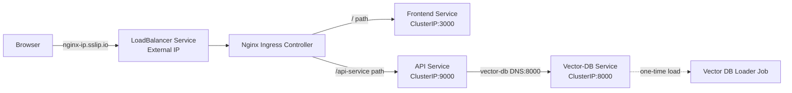

# AC215 - Milestone 5 - SKincare App - Deployment & Scaling
reference: https://github.com/dlops-io/skincare-app-v3/


In this section we will deploy the skincare App to GCP using Pulumi. We will automate all the deployment steps we did previously.


### Setup Docker Container (Pulumi, Docker, Kubernetes)

Rather than each of you installing different tools for deployment we will use Docker to build and run a standard container will all required software.

#### Run `deployment` container
- cd into `deployment`
- Go into `docker-shell.sh` and change `GCP_PROJECT` to your project id
- Run `sh docker-shell.sh`

- Check versions of tools:
```
gcloud --version
pulumi version
kubectl version --client
```

- Check to make sure you are authenticated to GCP
- Run `gcloud auth list`

troubleshooting
have to run
`gcloud auth configure-docker us-central1-docker.pkg.dev`

Now you have a Docker container that connects to your GCP and can create VMs, deploy containers all from the command line

### SSH Setup
#### Configuring OS Login for service account
Run this within the `deployment` container
```
gcloud compute project-info add-metadata --project <YOUR GCP_PROJECT> --metadata enable-oslogin=TRUE
```
example:
```
gcloud compute project-info add-metadata --project ac215-herm --metadata enable-oslogin=TRUE
```

#### Create SSH key for service account
```
cd /secrets
ssh-keygen -f ssh-key-deployment
cd /app
```

what is this for?

#### Providing public SSH keys to instances
```
gcloud compute os-login ssh-keys add --key-file=/secrets/ssh-key-deployment.pub
```
From the output of the above command keep note of the username. Here is a snippet of the output
```
 - accountId: ac215-herm
    gid: '4063475770'
    homeDirectory: /home/sa_108514330499178447129
    name: users/deployment@ac215-herm.iam.gserviceaccount.com/projects/ac215-herm
    operatingSystemType: LINUX
    primary: true
    uid: '4063475770'
    username: sa_108514330499178447129
```
The username is `sa_108514330499178447129`


#### Deployment Setup
* Add ssh user details in inventory.yml file
* GCP project details in inventory.yml file
* GCP Compute instance details in inventory.yml file


### Deployment (Single VM Instance)

#### Build and Push Docker Containers to Google Artifact Registry
We will use Pulumi to build & push container images
- cd into `deploy_images`
- When setting up pulumi for the first time run:
```
pulumi stack init dev
pulumi config set gcp:project ac215-herm
```

delete
```
# 1. 选择要删除的 stack
pulumi stack select dev

# 2. 查看 stack 中的资源
pulumi stack

# 3. 销毁所有资源
pulumi destroy

# 5. 删除 stack
pulumi stack rm dev

```


This will save all your deployment states to a GCP bucket

- If a stack has already been setup, you can preview deployment using:
```
pulumi preview --stack dev --refresh
```

- To build & push images run (This will take a while since we need to build 3 containers):
```
pulumi up --stack dev --refresh -y
```

#### Create Compute Instance (VM) & Deploy Containers
We will use Pulumi to automate this deployment
- cd into `deploy_single_vm` from the `deployment` folder
- When setting up pulumi for the first time run:
```
pulumi stack init dev
pulumi config set gcp:project ac215-herm
pulumi config set security:ssh_user sa_108514330499178447129
pulumi config set security:gcp_service_account_email deployment@ac215-herm.iam.gserviceaccount.com
```
This will save all your deployment states to a GCP bucket

- If a stack has already been setup, you can preview deployment using:
```
pulumi preview --stack dev --refresh
```

- To create a VM and deploy all our container images run:
```
pulumi up --stack dev --refresh -y
```

Once the command runs go to `http://<instance_ip>/` that is displayed in your terminal

You can SSH into the server from the GCP console and see status of containers
```
sudo docker container ls
sudo docker container logs api-service -f
sudo docker container logs frontend -f
sudo docker container logs nginx -f
```

To get into a container run:
```
sudo docker exec -it api-service /bin/bash
sudo docker exec -it nginx /bin/bash
```


## **Delete the Compute Instance / Persistent disk**
```
pulumi destroy --stack dev --refresh -y
```

## Deployment with Scaling using Kubernetes

In this section we will deploy the skincare app to a K8s cluster

### API's to enable in GCP for Project
Search for each of these in the GCP search bar and click enable to enable these API's
* Compute Engine API
* Service Usage API
* Cloud Resource Manager API
* Artifact Registry API
* Kubernetes Engine API

### Start Deployment Docker Container
-  `cd deployment`
- Run `sh docker-shell.sh`
- Check versions of tools
`gcloud --version`
`kubectl version`
`kubectl version --client`

- Check if make sure you are authenticated to GCP
- Run `gcloud auth list`


## Create & Deploy Cluster
- cd into `deploy_k8s` from the `deployment` folder
- When setting up pulumi for the first time run:
```
pulumi stack init dev
pulumi config set gcp:project ac215-herm
pulumi config set security:ssh_user sa_108514330499178447129
pulumi config set security:gcp_service_account_email deployment@ac215-herm.iam.gserviceaccount.com --stack dev
pulumi config set security:gcp_ksa_service_account_email deployment@ac215-herm.iam.gserviceaccount.com --stack dev
pulumi config set setupSSL false --stack dev // 上线之后要改成setupSSL: true
```
This will save all your deployment states to a GCP bucket

- If a stack has already been setup, you can preview deployment using:
```
pulumi preview --stack dev --refresh
```

- To create a cluster and deploy all our container images run:
```
pulumi up --stack dev --refresh -y
```


troubleshooting
add permission
gcloud iam service-accounts add-iam-policy-binding \
  deployment@ac215-herm.iam.gserviceaccount.com \
  --member="serviceAccount:deployment@ac215-herm.iam.gserviceaccount.com" \
  --role="roles/iam.serviceAccountUser" \
  --project=ac215-herm

Here is how the various services communicate between each other in the Kubernetes cluster.



### Try some kubectl commands
```
kubectl get all
kubectl get all --all-namespaces
kubectl get pods --all-namespaces
```

```
kubectl get componentstatuses
kubectl get nodes
```

### If you want to shell into a container in a Pod
```
kubectl get pods --namespace=skincare-app-namespace
kubectl get pod api-c4fb784b-2llgs --namespace=skincare-app-namespace
kubectl exec --stdin --tty api-c4fb784b-2llgs --namespace=skincare-app-namespace  -- /bin/bash
```

### View the App
* From the terminal view the results of Pulumi
```
Outputs:
    app_url         : "http://34.9.143.147.sslip.io"
    cluster_endpoint: "104.197.105.203"
    cluster_name    : "skincare-app-cluster"
    ingress_name    : "nginx-ingress"
    kubeconfig      : [secret]
    namespace       : "skincare-app-namespace"
    nginx_ingress_ip: "34.9.143.147"
```
* Go to `app_url`

### Delete Cluster
```
pulumi destroy --stack dev --refresh -y
```

---
#### View the App (If you have a domain)
1. Get your ingress IP:
   * Copy the `nginx_ingress_ip` value that was displayed in the terminal after running the cluster creation command or from GCP console -> Kubernetes > Gateways, Services & Ingress > INGRESS

   * Example IP: `34.148.61.120`

2. Configure your domain DNS settings:
   * Go to your domain provider's website (e.g., GoDaddy, Namecheap, etc.)
   * Find the DNS settings or DNS management section
   * Add a new 'A Record' with:
     - Host/Name: `@` (or leave blank, depending on provider)
     - Points to/Value: Your `nginx_ingress_ip`
     - TTL: 3600 (or default)

3. Wait for DNS propagation (can take 5-30 minutes)

4. Access your app:
   * Go to: `http://skinthecode.com`


#### Continous Deployment

if `/deploy-app` included in commit message, the cd for deployment will be triggered


## Debugging Containers

If you want to debug any of the containers to see if something is wrong

* View running containers
```
sudo docker container ls
```

* View images
```
sudo docker image ls
```

* View logs
```
sudo docker container logs api-service -f
sudo docker container logs frontend -f
sudo docker container logs nginx -f
```

* Get into shell
```
sudo docker exec -it api-service /bin/bash
sudo docker exec -it frontend /bin/bash
sudo docker exec -it nginx /bin/bash
```


```
# Check the init container logs:
kubectl logs -n skincare-app-cluster-namespace job/vector-db-loader -c wait-for-chromadb

# Check the main container logs:
kubectl logs -n skincare-app-cluster-namespace job/vector-db-loader -c vector-db-loader

# Check the job status:
kubectl describe job vector-db-loader -n skincare-app-cluster-namespace


# First, find the pod name for your job
kubectl get pods -n skincare-app-cluster-namespace | grep vector-db-loader

# Then get the logs from that pod (replace <pod-name> with the actual name)
kubectl logs -n skincare-app-cluster-namespace <pod-name>
kubectl logs -n skincare-app-cluster-namespace vector-db-loader-9gr5m

# If you want to see logs from the init container specifically
kubectl logs -n skincare-app-cluster-namespace <pod-name> -c wait-for-chromadb
kubectl logs -n skincare-app-cluster-namespace vector-db-loader-wlfdx -c wait-for-chromadb

# If you want to see logs from the main container
kubectl logs -n skincare-app-cluster-namespace <pod-name> -c vector-db-loader
kubectl logs -n skincare-app-cluster-namespace vector-db-loader-wlfdx -c vector-db-loader

# You can also get logs directly from the job (this will show logs from the most recent pod)
kubectl logs job/vector-db-loader -n skincare-app-cluster-namespace

# To see previous logs if the pod has restarted
kubectl logs job/vector-db-loader -n skincare-app-cluster-namespace --previous


# View logs from the current API pod
kubectl logs deployment/api -n skincare-app-cluster-namespace

# Follow the logs
kubectl logs deployment/api -n skincare-app-cluster-namespace -f
```
