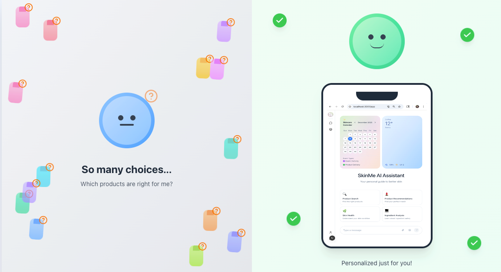
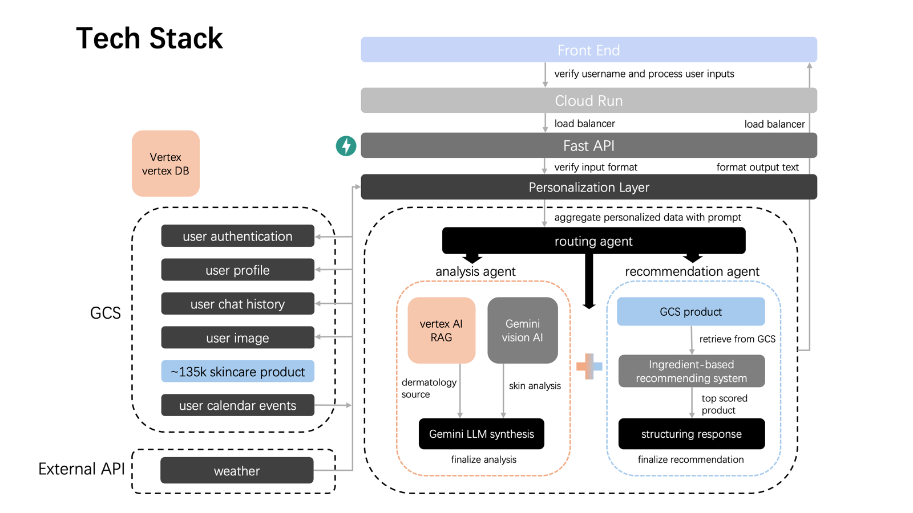

# Your Skincare Routine Deserves Better: How AI is Solving the $90 Billion Guessing Game

Walk into any drugstore and you'll face an overwhelming wall of skincare products—serums, creams, toners, and masks, each promising miraculous results. With over 135,000 products in the market and a new viral TikTok recommendation every minute, choosing the right skincare has become paralyzing. Industry experts point to this "fast beauty" phenomenon as a primary source of consumer confusion, leading to decision fatigue and wasted spending.

The numbers tell a striking story: **52% of consumers actively seek personalized skincare solutions**, yet **64% buy products that don't work for their skin**, and **42% experience adverse reactions** from unknown ingredients. The personalized skincare market has surged to **$25.1 billion in 2024**, growing at 8.3% annually. Our team saw this gap and built **SkinMe**, an AI-powered system that combines dermatological science with true personalization.

---

## The Problem: Information Overload Meets Real Costs

Here's the frustrating reality: you spend hours scrolling through product reviews, watching Tiktok tutorials about skincare. You finally buy that highly-rated serum everyone's raving about—only to find it makes your skin worse. Or maybe it just doesn't do anything at all.

The problem isn't lack of information—it's too much information without personalization. That $45 vitamin C serum your friend loves? It might irritate your sensitive skin. Those anti-aging ingredients perfect for dry climates? They could be too heavy for your humid summer weather. And nobody's telling you that mixing your new retinol with your old glycolic acid could damage your skin barrier.

Most frustrating of all: you have no objective way to track if products actually work. Did that moisturizer reduce your redness, or are you just hoping it did?

---

## Our Solution: Your Personal Dermatology Consultant, Available 24/7

Imagine texting a dermatologist at midnight when you notice a new breakout. Or showing them a photo of your skin and getting instant, personalized advice. That's what **SkinMe** does—except it's powered by AI that's studied thousands of dermatology articles and knows about 135,000+ skincare products.

**Here's how it works in plain words:**

You simply tell SkinMe what's bothering you: "My skin gets super dry in winter" or "I have acne on my cheeks." You can also upload a selfie. Within seconds, the system:

1. **Analyzes your concern** using the same AI technology (Google Gemini Vision) that can identify medical images
2. **Searches medical databases** for proven solutions—pulling from trusted sources like DermNet.org and academic research
3. **Recommends specific ingredients** that will actually help, organized into three simple categories:

   - **MUST-HAVE ingredients** — The scientifically proven ones for your concern (like ceramides for dry skin)
   - **BONUS ingredients** — Extra helpful additions (like antioxidants)
   - **AVOID ingredients** — Things that could make it worse (like alcohol if you have dry skin)

4. **Finds actual products** from 135,000+ options that contain the right ingredients and skip the harmful ones
5. **Creates your routine** — A simple morning and evening plan with explanations for each step

**What Makes SkinMe Different:**

Unlike generic beauty apps, SkinMe actually remembers you and adapts to your life:

- **It remembers your skin** — After one conversation about your allergies to fragrance, it never recommends scented products again
- **It tracks your progress** — Upload photos weekly and it shows you measurable improvements: "Your redness decreased 15% this month"
- **It checks your calendar** — Planning a beach trip next week? It proactively suggests sun protection products
- **It considers the weather** — Cold, dry winter day? It recommends heavier moisturizers. Hot, humid summer? Lighter formulas
- **No tedious forms** — Just mention "my skin gets oily in summer" during a conversation and it automatically remembers
- **Speaks your language** — Available in both English and Simplified Chinese

Think of it as having a dermatologist who knows your skin history, checks your schedule, looks at the weather forecast, and has memorized every skincare product on the market.

---

## The Technical Foundation: Built for Scale and Reliability

We chose **Google Cloud Platform** with **Vertex AI's RAG API** to ground recommendations in verified sources rather than letting AI hallucinate advice. When the system suggests niacinamide for hyperpigmentation, it cites real research.

**Tech Stack:**

- **Backend:** FastAPI with multi-agent architecture on Cloud Run (auto-scales to thousands of users)
- **Frontend:** Next.js + TypeScript + Capacitor (one codebase for web, iOS, Android)
- **AI/ML:** Google Gemini 2.0, Vertex AI RAG with dermatology corpus
- **Storage:** Google Cloud Storage with SHA-256 hashing; structured paths for fast retrieval
- **Deployment:** Docker + Kubernetes (99.9% uptime with auto-scaling)
- **Infrastructure:** Pulumi (version-controlled, no manual console work)
- **Data Versioning:** DVC with GCS backend (reproduce any dataset state with `git checkout dataset_v2 && dvc pull`)

**Quality & Challenges:**

Our CI/CD pipeline runs **xxxx** (unit, integration, system, E2E) achieving **xxx% coverage**. GitHub Actions automatically builds, tests, and deploys with zero downtime.

**Key Solutions:**
- **Trustworthy AI** → RAG retrieves actual literature before generating advice, preventing hallucinations
- **Speed** → Keyword-based routing + smart caching reduced response time to **under 3 seconds**
- **Privacy** → User-specific cloud folders with granular access; cross-device continuity via GCS
- **Testing Non-Deterministic AI** → Validate response structure/workflow patterns, not exact text; mock Vertex AI for predictable tests

---

## Real-World Impact: From Hours to Seconds, Guessing to Knowing

**The transformation is measurable:**

Before SkinMe, users spent hours researching products and still got it wrong 64% of the time. Now they get personalized recommendations in one conversation—and they understand the science behind each suggestion.

**What users are experiencing:**

- **No more trial-and-error** — The 64% who used to buy ineffective products now get personalized matches from 135,000 vetted options
- **Objective proof of progress** — See quantified improvements like "15% reduced redness" instead of guessing if products work
- **Automatic weather adjustments** — Your routine adapts when the temperature drops or humidity spikes
- **Calendar-aware skincare** — One tester told us: *"I never thought about needing different products before outdoor events until SkinMe reminded me"*

The biggest shift? **Skincare stops being guesswork and becomes science.** Instead of hoping that expensive serum works, you track measurable skin improvements week by week. You know exactly why each ingredient is in your routine and what it's doing.

For the technical community, this demonstrates how modern AI infrastructure solves domain-specific problems at scale—patterns that transfer to healthcare, finance, or education where accuracy and personalization matter.

---

For anyone drowning in skincare confusion, SkinMe offers a lifeline: **science-backed recommendations tailored to your unique skin, available instantly, tracking progress over time**. That's AI done right—making dermatological expertise accessible to everyone who needs it.

---

**Sources:**
- [Skincare Statistics (2025)](https://media.market.us/skincare-statistics/) | [Industry Trends 2025](https://www.beautyindependent.com/skincare-trends-soaring-2025/)
- [Personalized Market Report](https://www.towardshealthcare.com/insights/personalized-skin-care-products-market-sizing) | [GM Insights](https://www.gminsights.com/industry-analysis/personalized-customized-skin-care-market)

*SkinMe is open-source and deployed at http://35.232.57.208.sslip.io/ . Built for Harvard AC215 by Team HERM (Ruyi Yang, Minh Tran, Hang Zhao, Jingrui Liu).*
